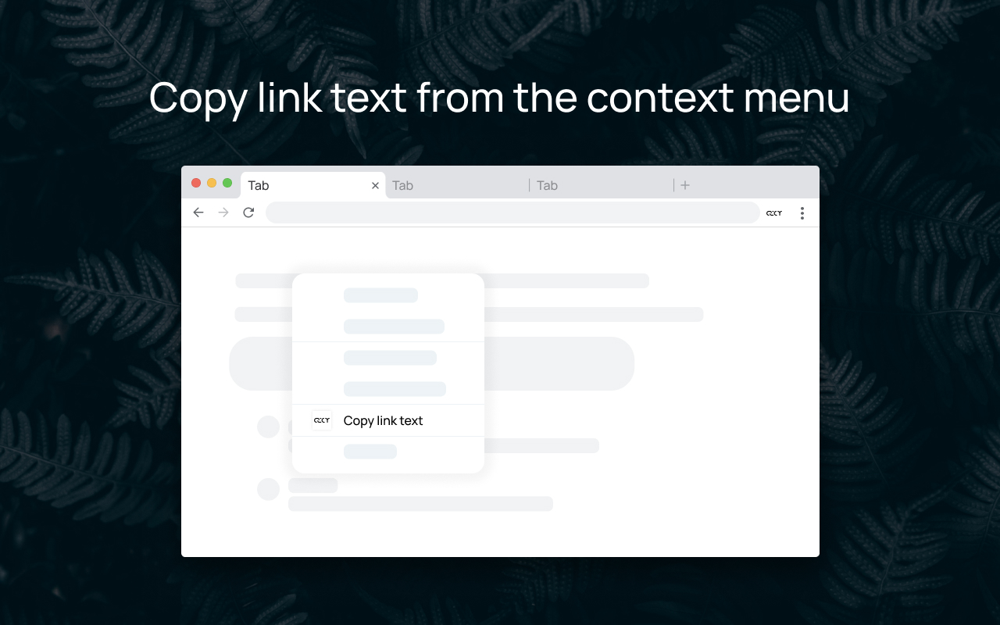

# Linext
> A lightweight tool to Copy link text from the context menu.

## 🚀 Features
* **Feature 1**: Copy link text by a context menu option.

## 🖼️ Main UI

## 🛠 Installation

### From Chrome Web Store
1. Visit the [Extension Page](https://chromewebstore.google.com/detail/pdcfkfnckdepfcphdkbemkhbijdppccj?utm_source=item-share-cb).
2. Click **Add to Chrome**.

### Manual Installation
1. Download or clone this repository: `git clone https://github.com/segnbi/linext-chrome.git`
2. Open Chrome and navigate to `chrome://extensions/`.
3. Enable **Developer mode**.
4. Click **Load unpacked** and select the project folder.